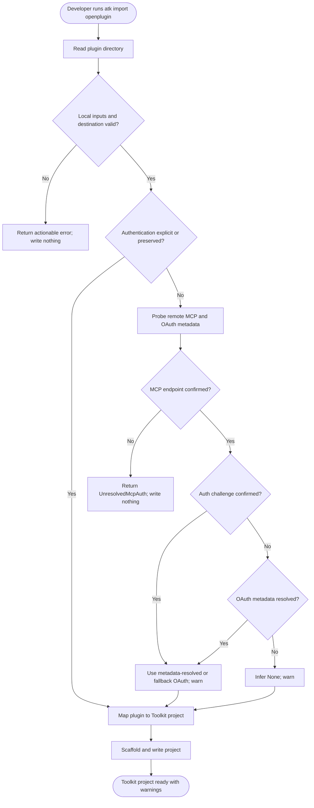

# Import an Open Plugin project

## Metadata

- Created: 2026-08-18T00:00:00Z
- Last updated: 2026-08-18T00:00:00Z
- Status: implemented
- PM owner: summzhan
- Engineer owner: @tecton
- Scenario group: toolkit
- Scenario ID: SCN-TOOLKIT-IMPORT-OPEN-PLUGIN
- Primary goal: migrate
- Start state: A developer has an Open Plugin, Claude Code plugin, or Cursor plugin directory.
- Success state: The developer has a scaffolded Agents Toolkit project with equivalent skills and MCP connectors.
- Lifecycle phases: [create]
- Visual/state reference: import-open-plugin.html

## Scenario

A developer imports an existing portable plugin through `atk import openplugin`. The Toolkit reads
the plugin manifest, skills, commands, and MCP server declarations, resolves connector
authentication, and writes a new Agents Toolkit project. When authentication is set to `Auto`, the
Toolkit may contact remote HTTPS MCP servers and their OAuth metadata endpoints before writing the
project. Explicit authentication choices and authentication preserved from a previous Toolkit
export do not trigger discovery.

## Surfaces

- CLI non-interactive: `atk import openplugin` with flags.
- VS Code and Visual Studio are not part of this scenario.

## States

- Success: the destination contains a usable Agents Toolkit project and inferred authentication
  decisions are reported as warnings.
- Input error: malformed plugin content, missing required developer URLs, too many MCP connectors,
  or a non-empty destination stops the import without modifying the destination.
- Authentication unresolved: Auto cannot establish an MCP endpoint/authentication result, so the
  import stops and asks the developer to verify the server and choose an explicit authentication
  type.
- Authentication challenge without metadata: Auto falls back to OAuth, creates the project, and
  warns the developer to verify the authentication type and register the placeholder reference.
- Untrusted source: the developer can select an explicit authentication type to skip outbound Auto
  discovery.

## User-visible outputs

- Creates the standard Agents Toolkit project baseline in the selected destination.
- Creates `appPackage/manifest.json` with imported `agentSkills` and URL-based `agentConnectors`.
- Copies imported skill and command files and creates package icons.
- Reports warnings for skipped stdio servers, unsupported source fields, sanitized skill metadata,
  every authentication choice inferred by Auto, and an OAuth fallback that lacks metadata.
- Creates no project files when local validation fails or Auto cannot confirm the MCP endpoint.

## Flow

## Validation notes

- L1 scenario coverage uses a temporary plugin directory and destination, stubbing only MCP/OAuth
  network calls and the static template provider.
- The scenario test asserts the generated project tree, mapped remote connector authorization, and
  visible Auto inference warning.
- L2 CLI E2E is deferred; it should verify command exit codes and emitted warnings with a controlled
  MCP endpoint.
- No L3 UI validation is applicable.
