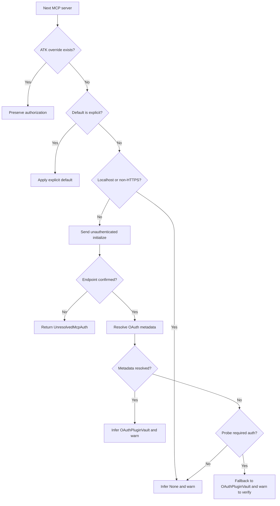

# Operation — `resolve-open-plugin-mcp-auth`

- **Status:** Approved
- **Product behavior change:** Existing `atk import openplugin` Auto authentication inference becomes evidence-based instead of URL-shape-based.
- **Related request:** [GitHub issue #16606](https://github.com/OfficeDev/microsoft-365-agents-toolkit/issues/16606)
- **Related architecture:** [`ADR-0020`](../../../02-architecture/adr/ADR-0020-mcp-server-url-validity.md), [remote MCP server facts](../../../02-architecture/external-dependencies/mcp-remote-servers.md)

## Purpose

Resolve the authorization type for every URL-based MCP server imported from an Open Plugin source.
The portable source does not carry connector authorization semantics, so `Auto` uses an
unauthenticated MCP `initialize` request and OAuth metadata discovery as evidence. Explicit
connector metadata and explicit CLI defaults remain authoritative.

## Inputs

| Input                   | Meaning                                                                 |
| ----------------------- | ----------------------------------------------------------------------- |
| Parsed MCP server map   | Named `.mcp.json` entries; only entries with a URL participate.         |
| ATK extension overrides | Per-connector authorization preserved by a previous ATK export.         |
| Default auth option     | `Auto`, `None`, `OAuthPluginVault`, or `ApiKeyPluginVault`.             |
| MCP auth probe          | Existing unauthenticated `initialize` probe and endpoint-status result. |
| OAuth metadata resolver | Existing RFC 9728 / RFC 8414 / OIDC discovery chain.                    |

## Outputs

The operation returns either:

- one authorization type per URL-based server plus ordered inference warnings; or
- an unresolved-auth `UserError` when the MCP endpoint itself cannot be confirmed, before project
  scaffolding or connector reference generation.

## Acceptance Criteria

| ID          | Runtime | Purpose               | Gate   | Harness                                          | Given / When / Then                                                                                                                                                                                                                                                            |
| ----------- | ------- | --------------------- | ------ | ------------------------------------------------ | ------------------------------------------------------------------------------------------------------------------------------------------------------------------------------------------------------------------------------------------------------------------------------ |
| OPI-AUTH-01 | L1      | operation-integration | per-PR | importer dependency fake                         | Given a connector authorization override preserved in the ATK extension, when importing with any default, then the override is retained and no network auth probe runs for that connector.                                                                                     |
| OPI-AUTH-02 | L1      | operation-integration | per-PR | importer dependency fake                         | Given an explicit `None`, `OAuthPluginVault`, or `ApiKeyPluginVault` default, when importing, then that type is applied to connectors without overrides and no network auth probe runs.                                                                                        |
| OPI-AUTH-03 | L1      | operation-integration | per-PR | importer dependency fake + temporary plugin tree | Given Auto, a remote MCP endpoint whose `initialize` response confirms the endpoint without an auth challenge, and no resolvable OAuth metadata, when importing, then the connector uses `None`, has no `referenceId`, and the result warns that Auto inferred the choice.     |
| OPI-AUTH-04 | L1      | operation-integration | per-PR | importer dependency fake + temporary plugin tree | Given Auto and a confirmed auth challenge with resolvable OAuth metadata, when importing, then the connector uses `OAuthPluginVault`, receives the deterministic placeholder `referenceId`, and the result warns that the reference still requires registration.               |
| OPI-AUTH-05 | L1      | operation-integration | per-PR | importer dependency fake + temporary plugin tree | Given Auto, a successful unauthenticated `initialize`, and resolvable OAuth metadata for a server that defers auth to tool calls, when importing, then the connector uses `OAuthPluginVault` and reports the inferred placeholder warning.                                     |
| OPI-AUTH-06 | L1      | operation-integration | per-PR | importer dependency fake + temporary plugin tree | Given Auto and an invalid URL or a probe that is `undetermined`, reports `notEndpoint`, or throws, when importing, then the operation returns `UnresolvedMcpAuth` before scaffolding and does not synthesize a connector reference.                                            |
| OPI-AUTH-07 | L1      | compatibility         | per-PR | mapper unit + importer dependency fake           | Given multiple connectors, explicit ATK overrides continue to win per connector, Auto resolutions are applied by server name in deterministic order, stdio entries remain skipped, and localhost/non-HTTPS entries retain the existing `None` behavior without network access. |
| OPI-AUTH-08 | L1      | operation-integration | per-PR | importer dependency fake + temporary plugin tree | Given Auto and a confirmed auth challenge whose OAuth metadata cannot be resolved, when importing, then the connector falls back to `OAuthPluginVault`, receives the deterministic placeholder `referenceId`, and warns that the type must be verified and registered.         |

## Flow

## Boundary

- The operation does not infer `ApiKeyPluginVault`; API-key auth remains explicit.
- It does not invoke tools to test tool-specific authorization.
- It does not register an OAuth client or validate that a generated reference already exists.
- It does not add a per-server CLI override syntax in this change.
- It does not change preserved ATK extension metadata or explicit default-auth semantics.
- It does not make the pure manifest mapper perform network I/O.
- Auto is an explicit local-client discovery action. The initial MCP URLs come from the imported
  plugin; server responses and redirects can direct subsequent metadata requests to other URLs.
  This operation does not define an egress allowlist or SSRF denylist. Callers that do not trust
  those URLs must select an explicit default, which skips discovery.

## Invariants

- Preserved per-connector authorization always wins.
- Explicit defaults never trigger auth discovery.
- An unresolved Auto decision never generates a project or placeholder `referenceId`.
- A connector with `None` never has a `referenceId`.
- Every inferred Auto decision is visible in the returned warnings.
- A confirmed auth challenge may fall back only to `OAuthPluginVault`, with a warning that the
  authentication type was not metadata-verified and the placeholder must be registered.
- A failed or inconclusive `initialize` probe never becomes evidence for `None` or `OAuthPluginVault`.
- Output and warning order are deterministic for equal resolved inputs.
